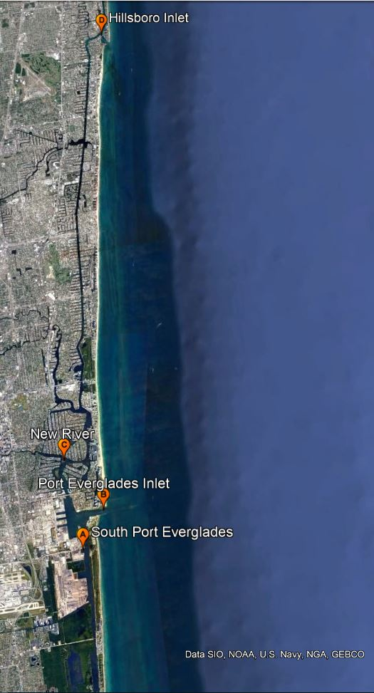
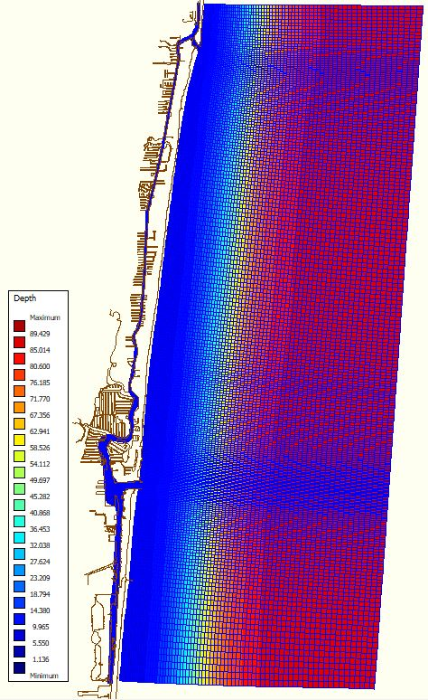
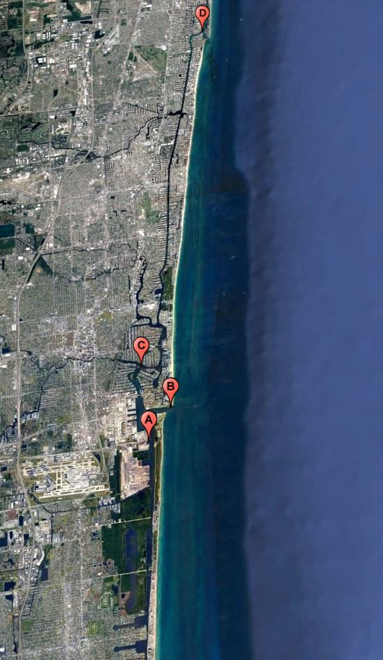
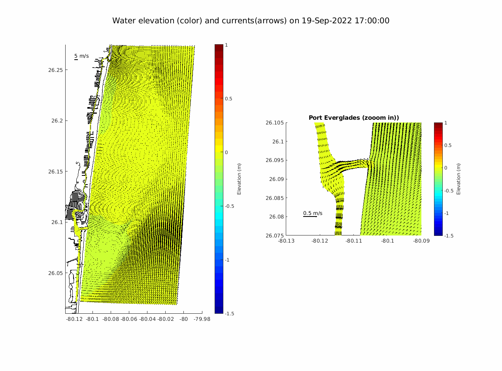
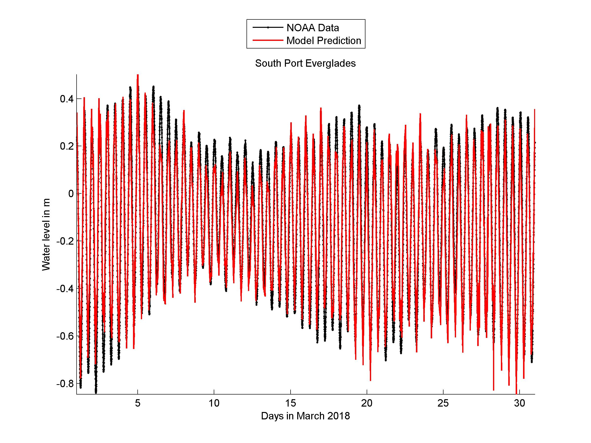
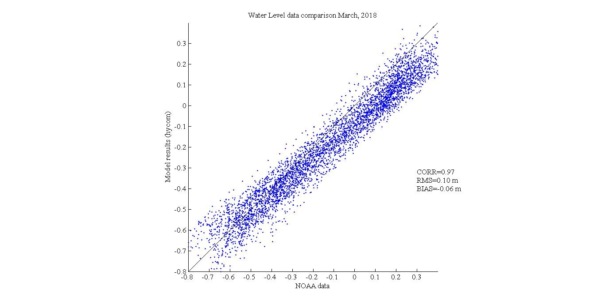

<html>  
<body>
  
 

  <h1>Model Setup </h1>
   
 We have developed numerical model using <a href="https://oss.deltares.nl/web/delft3d">Delft3D</a>, an open source, 3-dimensional, finite difference, hydrodynamic and sediment transport modeling system. A curvilinear orthogonal grid was created with grid size ranging from 9 m in inlet to 385 in the coastal area and with 5 sigma layers.  The grid represents coastline from Hillsboro Inlet to South Lake in Hollywood Beach.
    

   
   
 

  

    <h3>Developed by</h3>
    
 Ahsan Habib 

    
 <a href="https://www.fit.edu/faculty-profiles/8/gary-zarillo/">Dr. Gary Zarillo</a> 

    
 Dept of Ocean Engineering and Marine Sciences 

    
  

  

   <h1>Offshore Boundary Conditions</h1>
    
 The model is driven by water elevation time series that includes tides and lower frequency sea level oscillations, and meteorological forcing. The temperature, salinity and sea surface elevation along north, south and east open boundaries were derived from <a href="https://www.hycom.org/data/gomu0pt04/expt-90pt1m000">HYCOM and NCODA Gulf of Mexico 1/25° Analysis</a>. The meteorological forcing (relative humidity, air temperature, wind, heatflux and precipitation) was derived from <a href="https://www.ncdc.noaa.gov/data-access/model-data/model-datasets/north-american-mesoscale-forecast-system-nam">North American Mesoscale Forecast system (NAM).</a>
    

  

  
  

  <h1>Parameters Predicted</h1>
   <ul>
    <li> Salinity</li>
    <li> Temperature </li>
    <li>Currents </li>
    <li> Tidal constituents </li>
   </ul>
  
 
  
  

   <h1> Real Time Forecast</h1>
    
 Click on the <strong> placemarks </strong> on map for timeseries at these following stations. 
    

 
<ul>
 <li> South Port Everglades (A) </li>
 <li> Port Everglades Inlet (B) </li>
 <li> New River (C)</li>
 <li> Hillsboro inlet (D) </li> 
</ul> 

 

<map name="mapname">
    <area shape="rect" coords="202,586,228,635" href="waterlevel_porteverglades.jpg" alt="alttext">
    <area shape="rect" coords="233,536,263,591" href="waterlevel_evergladesinlet.jpg" alt="alttext">
    <area shape="rect" coords="191,480,217,529" href="waterlevel_plantriver.jpg" alt="alttext">
    <area shape="rect" coords="278,2,304,51" href="waterlevel_hillsboroinlet.jpg" alt="alttext">
 </map>
  
 
  
  

  
 Real time forecast for water elevetion and currents map in Port Everglades area (click on the animation for full screen view)
  
  

  

  
   
 

   <h1> Model Validation</h1>
   
 Model results for waterlevel timeseries were compared with data from <a href="https://tidesandcurrents.noaa.gov/stationhome.html?id=8722956">NOAA buoy</a> placed at south port everglades. There is a good match between model results and NOAA buoy data for water level timeseries with small difference in amplitude but very good match between phases. Correlation comparison is well over 90%.Following figures show some comparison.
     
          
   

  
  
  
</body>
</html>

