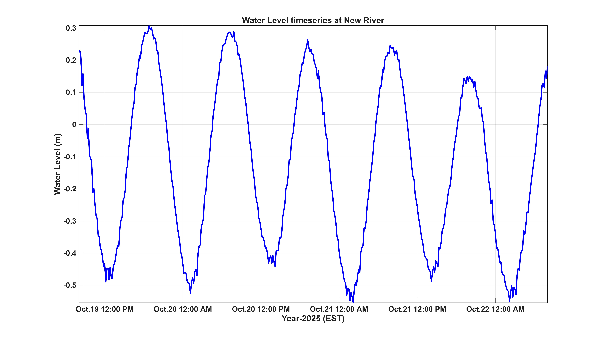

<html>
<body>
             
<h1> Model Setup </h1>

 We have developed numerical model using <a href="https://oss.deltares.nl/web/delft3d">Delft3D</a>, a 3-dimensional modeling suite for hydrodynamics, sediment transport and morphology, and water quality for estuarine and coastal environments. A curvilinear orthogonal grid was created with grid size ranging from 9 m in the inlet to 385 m in the coastal area and with 5 sigma layers.  The grid represents coastline from Hillsboro Inlet to South Lake in Hollywood Beach. 

Left: Model domain (Red rectangular box). Right: Zoomed model domain in the Sebastian Inlet. (Google Earth) 
      

 

Left: Model grid (subsampled one per three grid lines). Right: Detailed grid for Sebastian Inlet area 
      

<h1> Offshore Boundary Conditions</h1>

The model is driven by water elevation time series that includes tides and lower frequency sea level oscillations, and meteorological forcing. Temperature, salinity and sea surface elevation along north, south and east open boundaries were derived from <a href="https://www.hycom.org/data/gomu0pt04/expt-90pt1m000">HYCOM and NCODA Gulf of Mexico 1/25° Analysis</a>. Meteorological forcing (relative humidity, air temperature, wind forcing, heat flux, evaporation and precipitation) was derived from <a href="https://www.ncdc.noaa.gov/data-access/model-data/model-datasets/north-american-mesoscale-forecast-system-nam">North American Mesoscale Forecast system (NAM).</a>
Open boundary conditions for wave model have been derived from global wave model <a href="https://polar.ncep.noaa.gov/waves/ensemble/download.shtml?">WavewatchIII</a>. Significant wave height, peak period, wave direction and direction spreading data were derived from WavewatchIII. 

Temperature and salinity profile at East1 boundary node 
      
  
  

<h1>Model Validation</h1> 
  

Model results for water level timeseries were compared with data from buoy near Sebastian Inlet. There is a good match between model results and buoy data for water level timeseries with small difference in amplitude but very good match between phases. Correlation comparison is well over 90%. Salinity. temperature, and sig. wave height from simulation results were also compared with measured data. These comparisons showed good match with observed data. Following figures show these comparisons.

Water level timeseries comparison between model and measured data at Sebastian Inlet 
      
  
  

<h1> Real Time Forecast</h1>
<h3> Parameters Predicted </h3>
<ul>
    <li>Water level</li>
    <li> Salinity</li>
    <li> Temperature </li>
    <li> Currents </li>
    <li> Sig Wave Height</li>
    <li> Wave Direction</li>
    <li> Peak Period</li>
</ul>
  
<iframe width="850" height="700" src="https://datastudio.google.com/embed/reporting/ba3e86f3-36b1-4089-8d6f-1208d1dcef42/page/FNasC" frameborder="0" style="border:0" allowfullscreen></iframe>
  

3 days of timeseries forecast data has been provided here for LOBO, Sebastian Inlet, North Jetty, Wabasso Beach, and Indialantic Beach stations. 

<strong>Click</strong> on station names for timeseries forecast. 

<map name="mapname">
    <area shape="rect" coords="280,340,240,300" href="placemark_lobo.jpg" alt="alttext">
    <area shape="rect" coords="400,310,290,290" href="placemark_inlet.jpg" alt="alttext">
    <area shape="rect" coords="255,270,340,240" href="placemark_jetty.jpg" alt="alttext">
    <area shape="rect" coords="250,40,180,15" href="placemark_indialantic.jpg" alt="alttext">
    <area shape="rect" coords="460,450,350,420" href="placemark_wabasso.jpg" alt="alttext"> 
 </map>

Water level timeseries forecast at Port Everglades Inlet (left) and South Port Everglades (right) for 3 days  

 

3 days Water level timeseries forecast at Hillsboro Inlet (left) and New River (right).
      

 

Timeseries forecast of surface current at New River (left) and LOBO station (right) 

 

3 days forecast of surface salinity and temperature at LOBO station (left) and Sebastian Inlet (right) 
      

 

Water level and Surface Current forecast map.

 

Salinity and Surface Current forecast map.

 

 

<h3> Developed by </h3>

 Ahsan Habib, PhD Candidate 

 <a href="https://www.fit.edu/faculty-profiles/8/gary-zarillo/">Dr. Gary Zarillo, PhD </a> 

 Dept of Ocean Engineering and Marine Sciences 

</body>
</html>

